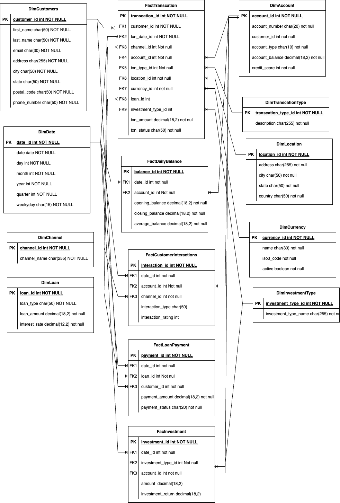

Welcome to your new dbt project!

### Using the starter project

Try running the following commands:
- dbt run
- dbt test

### Resources:
- Learn more about dbt [in the docs](https://docs.getdbt.com/docs/introduction)
- Check out [Discourse](https://discourse.getdbt.com/) for commonly asked questions and answers
- Join the [chat](https://community.getdbt.com/) on Slack for live discussions and support
- Find [dbt events](https://events.getdbt.com) near you
- Check out [the blog](https://blog.getdbt.com/) for the latest news on dbt's development and best practices

 # Data Warehouse Architecture
The image below illustrates the architecture of our data warehouse, detailing the flow of data from various sources to the analytics layer.

## Key Features:
1. **ETL Process**: Data is extracted from multiple sources, transformed, and loaded into the staging area.
2. **Data Storage**: Centralized storage for structured, semi-structured, and unstructured data.
3. **Analytics and Reporting**: Optimized for running complex queries and generating business insights.
4. **Scalability**: Designed to handle growing data needs efficiently.
